# KITS ProjectHub — Learning Platform Implementation Report

**Status:** Completed & Validated  
**Specification:** [KITS_ProjectHub_Learning_Platform_Spec.md](file:///e:/kits-projecthub/KITS_ProjectHub_Learning_Platform_Spec.md)  
**Database:** Relational SQL Database (`better-sqlite3` SQLite with WAL mode & foreign keys enabled)

---

## 1. System Architecture & Relational SQL Database

The backend has been implemented using **Node.js, Express, and SQLite SQL database** ([schema.sql](file:///e:/kits-projecthub/backend/src/db/schema.sql)), storing all entities in a dedicated, high-performance local SQLite database (`backend/data/kits_projecthub.db`).

```mermaid
graph TB
    subgraph Frontend [React + TypeScript UI]
        NAV[Main Navigation: Explore · Paths · My Learning · Community · Mentor Help · Portfolio]
        EXP[Explore Projects & Filters]
        DET[Project Details: 5 Tabs + Start Project]
        LP[Learning Paths: 2 Curated Tracks]
        ML[My Learning Workspace & Drafts]
        COM[Community Discussions & Peer Review]
        MH[Mentor Help & Solution Verification]
        PORT[Evidence Portfolio & JSON Export]
        REV[Faculty Review Queue & 0-4 Rubric]
    end

    subgraph Backend [Node.js Express + SQL Services]
        SRV[server.ts]
        API_P[projectSqlService]
        API_G[groupSqlService]
        API_L[learningSqlService]
        API_A[assessmentSqlService]
        API_C[communitySqlService]
        API_M[mentorSqlService]
        API_E[evaluationSqlService]
    end

    subgraph SQL_Database [SQLite Relational Engine]
        DB[(kits_projecthub.db)]
        T1[users & departments]
        T2[official_groups & members]
        T3[projects & project_versions]
        T4[milestones & rubrics]
        T5[practice_checks & pathways]
        T6[learner_attempts & drafts]
        T7[milestone_revisions & audit_events]
        T8[skill_states & assessment_reviews]
    end

    Frontend -->|REST API calls| Backend
    Backend -->|better-sqlite3 transactions| SQL_Database
```

---

## 2. Core Specification Rules Implemented & Verified

### A. Universal Free Access & Authorship Separation
- **No Access Gates:** Subject, department, year, previous grades, and pathway completion never lock a project. Prerequisites describe preparation; they do not restrict access.
- **Three Separate Identities:**
  1. *Reference Project:* Published material with original team authors, repo, and demo preserved unchanged.
  2. *Learner Attempt:* Private learner workspaces (`learner_attempts`, `milestone_drafts`) anchored to a project version.
  3. *Verified Skill Evidence:* Qualified faculty reviewer decisions tied to named skills and 0-4 rubric benchmarks.

### B. Mandatory Official Group Submissions (Spec Section 1.1)
- **4, 5, or 6 Confirmed Members:** The server strictly rejects official project creation or submission until the group has 4–6 confirmed students (`error: 'Submission rejected: Group must have 4, 5, or 6 confirmed members'`).
- **Single Official Group Rule:** Each verified student belongs to only one official group across the portal. Alternate logins or roll numbers are blocked by database constraints.
- **Freeze at Creation:** Membership freezes when the official project is created.
- **Duplicate Prevention:** Repositories, demo links, and fingerprints are checked against existing records.

### C. Milestone Workspace & Draft Management (Prompt 3 & Section 5)
- **Resume Next Milestone:** Learners can jump to any milestone directly.
- **Comprehensive Draft Editor:**
  - Artifact links & evidence files.
  - Architectural decisions & design explanations.
  - Test measurements, calibration data, and benchmarks.
  - Personal reflection.
  - Individual contribution statements.
  - Mandatory Academic Integrity & AI assistance declarations.
- **Audited Revision History:** Each draft save creates an immutable versioned snapshot in `milestone_revisions`.
- **Unsaved Work Protection:** Sticky banner and browser `beforeunload` warning prevent accidental loss of work.

### D. Activity vs. 4-Level Skill States
- **Activity Completion ≠ Demonstrated Skill:** Checking off a milestone or watching a video never awards a verified skill.
- **4-Level Skill Taxonomy:**
  1. `Not attempted`
  2. `Practising` (Self-directed practice, draft saving, practice checks)
  3. `Demonstrated` (Requires independent core task scoring $\ge 3$ across all criteria from an authorized faculty reviewer)
  4. `Transfer demonstrated` (Requires separate transfer challenge altering context or constraints)

### E. Low-Stakes Practice Checks & Embedded Resources
- Embedded beside milestones: written tutorials, setup instructions, captioned video transcripts, starter assets with download sizes, hints, and reference walkthroughs.
- Low-stakes practice checks with immediate explanatory feedback and misconception diagnosis; never lock the project.

### F. Formative Peer Review & Community
- Structured peer review protocol with the three required questions:
  1. *What works?*
  2. *What evidence is missing?*
  3. *What should change next?*
- Project discussions with opt-in artifact sharing.

### G. Asynchronous Mentor Queue
- Mandatory student attempted solution: questions require students to detail what troubleshooting they already attempted before queue entry.
- Published department support hours and consultation schedule.

### H. Evidence Portfolio & Evaluation Metrics
- Private portfolio assembly with explicit per-item public visibility toggles.
- One-click export to verifiable JSON.
- Evaluation metrics endpoint reporting real denominators, transfer success rates, and small-group suppression.

### I. Accessibility & Low-Data Mode (WCAG 2.2 AA)
- Text-first low-data mode toggle: disables auto video streams and emphasizes plain-text instructions.
- Accessible color palette (KITS Magenta `#CA0765`, KITS Blue `#0070C2`, `#19232B` text).

---

## 3. Key Files Created and Modified

| Layer | File Link | Description |
|---|---|---|
| **SQL Schema** | [schema.sql](file:///e:/kits-projecthub/backend/src/db/schema.sql) | 24 relational SQL tables covering users, groups, projects, milestones, rubrics, drafts, reviews, skills, and audit logs. |
| **SQL Database** | [database.ts](file:///e:/kits-projecthub/backend/src/db/database.ts) | SQLite database connection, WAL mode, foreign keys, and seeders. |
| **Backend Services** | [projectSqlService.ts](file:///e:/kits-projecthub/backend/src/services/projectSqlService.ts) | Public catalog search, filters, pagination, and project details. |
| | [groupSqlService.ts](file:///e:/kits-projecthub/backend/src/services/groupSqlService.ts) | Official group 4-6 member constraint and single-group enforcement. |
| | [learningSqlService.ts](file:///e:/kits-projecthub/backend/src/services/learningSqlService.ts) | Private learner attempts, drafts, revision snapshots, and practice checks. |
| | [assessmentSqlService.ts](file:///e:/kits-projecthub/backend/src/services/assessmentSqlService.ts) | 0-4 rubric evaluation, reviewer queue, and skill verification. |
| | [pathwaySqlService.ts](file:///e:/kits-projecthub/backend/src/services/pathwaySqlService.ts) | Learning pathway and step queries without access gating. |
| | [communitySqlService.ts](file:///e:/kits-projecthub/backend/src/services/communitySqlService.ts) | Discussions and structured peer reviews. |
| | [mentorSqlService.ts](file:///e:/kits-projecthub/backend/src/services/mentorSqlService.ts) | Asynchronous queue with mandatory attempted solution verification. |
| | [portfolioSqlService.ts](file:///e:/kits-projecthub/backend/src/services/portfolioSqlService.ts) | Private assembly, public sharing, and portfolio management. |
| | [evaluationSqlService.ts](file:///e:/kits-projecthub/backend/src/services/evaluationSqlService.ts) | Pilot evaluation analytics with real counts and denominators. |
| **API Client** | [apiClient.ts](file:///e:/kits-projecthub/frontend/src/services/apiClient.ts) | Frontend SQL REST API client connecting to backend endpoints. |
| **Frontend Pages** | [MyLearning.tsx](file:///e:/kits-projecthub/frontend/src/pages/MyLearning.tsx) | Complete milestone workspace with draft editor, revisions, rubrics, and practice checks. |
| | [Community.tsx](file:///e:/kits-projecthub/frontend/src/pages/Community.tsx) | Discussions and 3-question structured peer review tool. |
| | [MentorHelp.tsx](file:///e:/kits-projecthub/frontend/src/pages/MentorHelp.tsx) | Mentor queue with attempted solution check and support hours. |
| | [Portfolio.tsx](file:///e:/kits-projecthub/frontend/src/pages/Portfolio.tsx) | Evidence portfolio, public visibility controls, and JSON export. |
| | [ProjectDetails.tsx](file:///e:/kits-projecthub/frontend/src/pages/ProjectDetails.tsx) | Added Start Project action and navigation to learner attempt. |
| | [Navbar.tsx](file:///e:/kits-projecthub/frontend/src/components/Navbar.tsx) | Updated main navigation with spec items and responsive mobile drawer. |
| | [App.tsx](file:///e:/kits-projecthub/frontend/src/App.tsx) | Wired all routes and low-data mode toggle. |
